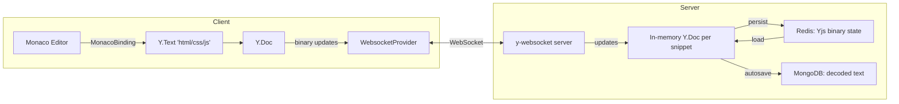

# CRDT Integration Analysis: Yjs + y-monaco

## 1. What Your Codebase Currently Does (and Why It's Broken)

### The LWW chain — traced through your own files

The bug lives in **two places** that work together as a "last timestamp wins" strategy.

**Server-side — `server/src/routes/socket/index.ts`, L53–61**

```typescript
async function setCode(snippetId: string, lang: Lang, code: string, ts: number) {
  const k = codeKey(snippetId);
  const currentTs = Number(await redis.hget(k, `${lang}UpdatedAt`)) || 0;
  if (ts >= currentTs) {           // ← LWW gate: newer timestamp wins
    await redis.hset(k, { [lang]: code, [`${lang}UpdatedAt`]: String(ts) });
    return true;
  }
  return false;                    // ← older change is SILENTLY DROPPED
}
```

**Client-side — `client/src/pages/Editor.tsx`, L137–140**

```typescript
function broadcast(lang: 'html' | 'css' | 'js', code: string) {
  if (!socket || !snippetId) return;
  socket.emit('code-change', { snippetId, language: lang, code, ts: Date.now() });
  //                                                              ↑ entire document sent
}
```

### The concrete failure scenario

```
User A types "Hello"   → ts=1000  → Redis accepts, broadcasts "Hello"
User B types "World"   → ts=999   → Server: ts < currentTs → DROPPED, "World" is lost
Network reorders them  → A's ts=1001 arrives after B's ts=1002 → A's work is LOST
```

This happens because:
- `Date.now()` timestamps from two different machines are **not synchronized**
- The server only compares timestamps, it never *merges* content
- Full document replacement on every keystroke means concurrent edits atomically clobber each other

---

## 2. What Yjs + y-monaco Give You Instead

| Concern            | Your LWW                                            | Yjs CRDT                               |
| ------------------ | --------------------------------------------------- | -------------------------------------- |
| Concurrent edits   | Last writer wins (data loss)                        | All ops merged losslessly              |
| Network ordering   | Must be ordered; out-of-order = loss                | Order-independent; any order works     |
| Offline edits      | Draft only, merge conflict on reconnect             | Auto-merge on reconnect                |
| Bandwidth          | Full document per keystroke                         | Binary delta (just the change)         |
| Cursor tracking    | Manual `lineNumber/column` → breaks on remote edits | Relative positions anchored to content |
| Monaco integration | `value` prop (re-render everything)                 | Native `MonacoBinding` (zero flicker)  |

---

## 3. Packages to Add

### Client (`client/`)
```bash
npm install yjs y-websocket y-monaco
```

| Package       | Role                                         |
| ------------- | -------------------------------------------- |
| `yjs`         | The CRDT document (`Y.Doc`)                  |
| `y-websocket` | WebSocket provider that syncs the doc        |
| `y-monaco`    | Binds a `Y.Text` to a Monaco editor instance |

### Server (`server/`)
```bash
npm install y-websocket ws
```
The server needs only the `y-websocket` WebSocket server (or you can use `ws` directly with the y-websocket handler). No extra Yjs lib needed server-side for basic persistence.

---

## 4. Architecture After the Change



- **No more `ts` comparison** — Yjs handles concurrency internally via its internal vector clock (state vector)
- **No more full-document `code-change` events** — only binary diffs flow over the wire
- **Redis stores the Yjs binary state** (a binary blob), not raw text strings

---

## 5. What to Change: File-by-File

### 5.1 `client/src/components/CodeEditor.tsx` — **Major change**

**Current**: receives `value: string` and `onChange: (v: string) => void`, controlled by React state.

**After**: receives a `Y.Text` object and connects via `MonacoBinding`. The editor becomes **uncontrolled** — Yjs directly mutates Monaco's model.

```typescript
// BEFORE (current)
<Editor
  value={value}
  onChange={(v) => onChange(v || '')}
  onMount={(editor, monaco) => { monacoRef.current = { editor, monaco }; }}
/>

// AFTER (yjs)
<Editor
  // NO value / onChange props
  defaultLanguage={language}
  onMount={(editor, monaco) => {
    monacoRef.current = { editor, monaco };
    // Bind yText to this editor
    const binding = new MonacoBinding(
      yText,                              // Y.Text shared type
      editor.getModel()!,                 // Monaco text model
      new Set([editor]),
      awareness                           // for remote cursors
    );
    bindingRef.current = binding;         // store to cleanup on unmount
  }}
/>
```

Props change from `{ value, onChange }` → `{ yText: Y.Text, awareness: Awareness }`.

What to **keep**: theme observer, Ctrl+S handler, remote cursor decorations (those come from `awareness` now, but the decoration rendering code can stay mostly the same).

---

### 5.2 `client/src/pages/Editor.tsx` — **Major change**

This is the most invasive change. Here's what the new data flow looks like:

**Remove entirely:**
- `const [html, setHtml] = useState('')` (and `css`, `js`)
- `function broadcast(lang, code)` — the entire function
- The `socket.emit('code-change', ...)` calls inside `onChange`
- `const onCode = (p: any) => { ... }` socket listener
- `socket.on('code-updated', onCode)` and its off()

**Add:**
```typescript
import * as Y from 'yjs';
import { WebsocketProvider } from 'y-websocket';

const ydocRef  = useRef<Y.Doc | null>(null);
const providerRef = useRef<WebsocketProvider | null>(null);

useEffect(() => {
  if (!snippetId || !token) return;

  const ydoc = new Y.Doc();
  const wsUrl = (import.meta as any).env.VITE_YJS_URL || 'ws://localhost:1234';

  const provider = new WebsocketProvider(wsUrl, `snippet-${snippetId}`, ydoc, {
    params: { token }        // pass JWT for auth on the y-websocket server
  });

  ydocRef.current = ydoc;
  providerRef.current = provider;

  return () => {
    provider.destroy();
    ydoc.destroy();
  };
}, [snippetId, token]);

// Access the shared text for each language
const htmlText = ydocRef.current?.getText('html');
const cssText  = ydocRef.current?.getText('css');
const jsText   = ydocRef.current?.getText('js');
```

For **saving** (Ctrl+S), read the text directly from Yjs:
```typescript
async function doSave() {
  const doc = ydocRef.current;
  if (!doc) return;
  await api.put(`/api/snippets/${snippetId}`, {
    html: doc.getText('html').toString(),
    css:  doc.getText('css').toString(),
    js:   doc.getText('js').toString(),
  });
}
```

For **LivePreview**, subscribe to Yjs observe events:
```typescript
const [previewHtml, setPreviewHtml] = useState('');
const [previewCss,  setPreviewCss]  = useState('');
const [previewJs,   setPreviewJs]   = useState('');

useEffect(() => {
  const doc = ydocRef.current;
  if (!doc) return;
  const update = () => {
    setPreviewHtml(doc.getText('html').toString());
    setPreviewCss(doc.getText('css').toString());
    setPreviewJs(doc.getText('js').toString());
  };
  doc.on('update', update);
  return () => doc.off('update', update);
}, [ydocRef.current]);
```

> **Offline draft**: You can **remove** the `localStorage` draft system entirely. Yjs's `WebsocketProvider` handles offline reconnection by syncing pending updates on reconnect automatically. If you want persistence across browser restarts, add `y-indexeddb`.

---

### 5.3 `server/src/routes/socket/index.ts` — **Remove the LWW logic**

The `setCode`, `getOrInitCode`, and `codeKey` functions all go away. The y-websocket server replaces them.

You have two options:

**Option A — Separate y-websocket server (recommended, cleanest)**

Run a dedicated `y-websocket` server on port `1234` alongside your Express server:

```typescript
// server/src/yjs-server.ts  (NEW FILE)
import { WebSocketServer } from 'ws';
import * as Y from 'yjs';
import { setupWSConnection, getYDoc } from 'y-websocket/bin/utils';
import { redis } from './db/redis';

const wss = new WebSocketServer({ port: 1234 });
const PERSIST_INTERVAL = 30_000; // 30s

wss.on('connection', async (conn, req) => {
  // Optional: verify JWT from URL param ?token=...
  const url = new URL(req.url!, `http://localhost`);
  const token = url.searchParams.get('token');
  // verifyJwt(token) — throw/close if invalid

  const docName = (req.url ?? '').split('/').pop() ?? 'default';

  // Load persisted Yjs state from Redis
  const saved = await redis.getBuffer(`yjs:${docName}`);
  if (saved) {
    const ydoc = getYDoc(docName);
    Y.applyUpdate(ydoc, saved);
  }

  setupWSConnection(conn, req, { docName, gc: true });
});

// Persist Yjs binary state to Redis every 30s
setInterval(async () => {
  // Iterate active docs and persist each
}, PERSIST_INTERVAL);
```

**Option B — Integrate into existing Express server (simpler)**

Use `ws` and handle upgrade inside your existing `src/index.ts`:

```typescript
import { WebSocketServer } from 'ws';
import { setupWSConnection } from 'y-websocket/bin/utils';

// after httpServer is created:
const yjsWss = new WebSocketServer({ noServer: true });
httpServer.on('upgrade', (req, socket, head) => {
  if (req.url?.startsWith('/yjs')) {
    yjsWss.handleUpgrade(req, socket as any, head, (ws) => {
      yjsWss.emit('connection', ws, req);
    });
  }
});
yjsWss.on('connection', setupWSConnection);
```

**What to keep** in the existing socket handler:
- `join-snippet`, `leave-snippet`, `active-users`, `user-joined`, `user-left` — **keep all**, they handle presence
- `cursor-move` / `cursor-updated` — **can be replaced by Yjs Awareness**, but keep as fallback
- `typing` / `user-typing` — **keep**, Yjs doesn't have built-in typing indicators
- `autosave` every 30s → change to read `ydoc.getText('html').toString()` instead of Redis hash fields

---

### 5.4 Redis Schema Change

**Current (text-based):**
```
snippet:{id}:code  →  HASH { html, css, js, htmlUpdatedAt, cssUpdatedAt, jsUpdatedAt }
```

**After (binary Yjs state):**
```
yjs:snippet-{id}  →  STRING (binary Buffer — Y.encodeStateAsUpdate(ydoc))
```

On first connection, load the binary state into the in-memory Y.Doc:
```typescript
const saved = await redis.getBuffer(`yjs:snippet-${snippetId}`);
if (saved) Y.applyUpdate(ydoc, saved);
```

On persist/autosave:
```typescript
const state = Y.encodeStateAsUpdate(ydoc);
await redis.set(`yjs:snippet-${snippetId}`, Buffer.from(state));
```

Seed initial content from MongoDB on very first load (before any Yjs state exists):
```typescript
// If no saved Yjs state, pre-populate from MongoDB text
const snip = await Snippet.findById(snippetId);
if (snip) {
  ydoc.getText('html').insert(0, snip.html || '');
  ydoc.getText('css').insert(0, snip.css || '');
  ydoc.getText('js').insert(0, snip.js || '');
}
```

---

### 5.5 Remote Cursors (Awareness API)

Replace the manual `cursor-move` / `cursor-updated` socket events with Yjs's built-in **Awareness** protocol:

```typescript
// In Editor.tsx
const awareness = providerRef.current?.awareness;

// Publish local cursor
awareness?.setLocalStateField('user', { name: user?.name, color });
awareness?.setLocalStateField('cursor', {
  anchor: Y.createRelativePositionFromTypeIndex(yText, cursorOffset),
  head:   Y.createRelativePositionFromTypeIndex(yText, cursorOffset),
});

// Subscribe to remote cursors
awareness?.on('change', () => {
  const states = Array.from(awareness.getStates().entries());
  // map to Monaco decorations
});
```

The `MonacoBinding` from `y-monaco` wires this up automatically — remote cursors and selections just work out of the box.

---

## 6. Summary: What to Add / Remove / Keep

| File                   | Action         | Key Change                                                                                    |
| ---------------------- | -------------- | --------------------------------------------------------------------------------------------- |
| `client/package.json`  | Add deps       | `yjs`, `y-websocket`, `y-monaco`                                                              |
| `server/package.json`  | Add deps       | `y-websocket`, `ws`                                                                           |
| `CodeEditor.tsx`       | Rewrite        | Props → `yText + awareness`; use `MonacoBinding` in `onMount`                                 |
| `Editor.tsx`           | Major rewrite  | Remove `html/css/js` state, `broadcast()`, `onCode` listener; add Y.Doc + WebsocketProvider   |
| `socket/index.ts`      | Partial remove | Delete `setCode`, `getOrInitCode`, `codeKey`, `code-change` handler; keep all presence events |
| `server/yjs-server.ts` | **NEW FILE**   | y-websocket server with Redis load/persist                                                    |
| Redis schema           | Change         | Binary Yjs state blob instead of text hash with timestamps                                    |
| LocalStorage draft     | **Remove**     | y-websocket handles offline reconnection natively                                             |

---

## 7. LWW Lines to Kill

| Location          | Lines                  | What dies                                                  |
| ----------------- | ---------------------- | ---------------------------------------------------------- |
| `Editor.tsx`      | L136–140               | `broadcast()` function — entirely deleted                  |
| `Editor.tsx`      | L139                   | `ts: Date.now()` — meaningless with CRDT                   |
| `Editor.tsx`      | L68–83                 | `onCode` socket listener — replaced by `ydoc.on('update')` |
| `socket/index.ts` | L53–61                 | `setCode()` — the LWW gate — entirely deleted              |
| `socket/index.ts` | L21                    | `CodeState` interface — old schema, gone                   |
| `socket/index.ts` | L29–51                 | `getOrInitCode()` — replaced by Yjs doc loading            |
| `socket/index.ts` | L128–140               | `code-change` handler — replaced by y-websocket            |
| Redis             | `htmlUpdatedAt` fields | Yjs uses binary state vector, not wall-clock timestamps    |

---

## 8. Migration Risk & Rollout Strategy

> **⚠️ IMPORTANT**: This is a **breaking change** to the real-time sync protocol. Existing Redis state in the old hash format will not be readable by Yjs.

**Recommended rollout:**

1. **Use a new Redis key prefix** (`yjs:snippet-{id}` vs old `snippet:{id}:code`) — avoids old data poisoning, allows rollback
2. **Seed Yjs docs from MongoDB** on first connection (text already exists in `Snippet.html/css/js`)
3. **Feature-flag the Yjs WS URL** via `VITE_YJS_URL` env var — lets you switch back instantly
4. **Keep the REST save endpoint unchanged** — `doSave` reads from `ydoc.getText()` instead of React state, same API

> **✅ NOTE**: Typing indicators, tab switching, Ctrl+S, fork, rename, delete — **none of these change**. Only the real-time sync channel and editor binding are replaced.
