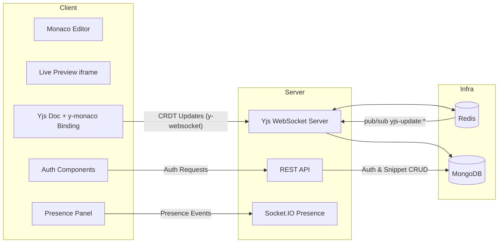

# Collaborative Code Editor Platform

> A production-ready, full-stack solution for real-time collaborative coding, designed with scalability, security, and performance in mind.


## Table of Contents
- [Collaborative Code Editor Platform](#collaborative-code-editor-platform)
  - [Table of Contents](#table-of-contents)
  - [🚀 About](#-about)
  - [✨ What's New](#-whats-new)
    - [Version 1.0.0 (Latest)](#version-100-latest)
      - [🚀 Features](#-features)
      - [⚡ Performance](#-performance)
  - [🛡 Standards \& Security](#-standards--security)
  - [🏗 Architecture](#-architecture)
  - [⚠️ Known Limitations](#️-known-limitations)
  - [🔨 How to Build](#-how-to-build)
    - [Prerequisites](#prerequisites)
    - [🐳 Quick Start (Recommended)](#-quick-start-recommended)
    - [🔧 Manual Setup (Detailed)](#-manual-setup-detailed)
      - [1. Database Setup](#1-database-setup)
      - [2. Backend Configuration](#2-backend-configuration)
      - [3. Frontend Configuration](#3-frontend-configuration)
    - [⚠️ Troubleshooting](#️-troubleshooting)
  - [📚 Documentation](#-documentation)
  - [🤝 Feedback and Contributions](#-feedback-and-contributions)
  - [🙏 Acknowledgments](#-acknowledgments)
  - [📞 Support](#-support)

## 🚀 About

The **Collaborative Code Editor Platform** is a robust .NET-inspired, full-stack JavaScript solution designed to facilitate seamless real-time code collaboration. It adheres to high standards of interactivity and reliability, utilizing modern event-driven architectures and state-of-the-art web technologies.

This platform is engineered to solve the complex challenges of concurrent editing, providing a Google Docs-like experience for developers. Key architectural benefits include:

*   **Real-Time Synchronization**: Built on Yjs CRDT over a dedicated `y-websocket` WebSocket server for low-latency, conflict-free bidirectional editing — every keystroke is merged and synced instantly across all connected clients without data loss.
*   **Scalability**: The separation of the frontend (React/Vite) and backend (Node/Express) allows for independent scaling. Redis persists the binary Yjs document state and acts as the realtime sync cache, while a Redis pub/sub channel (`yjs-update:*`) keeps multiple server nodes in sync.
*   **Security**: Built-in JWT authentication (on both REST and the collaboration socket) and a sandboxed live-preview iframe protect both the user and the server from malicious code and unauthorized access.
*   **Resilience**: MongoDB provides durable persistence for code snippets; the Yjs document is periodically autosaved and also flushed on disconnect, so collaborative work is never lost.

Specifically tailored for developer interviews, education, and pair programming, this platform integrates a rich code editing experience (Monaco Editor) with a live preview engine.

## ✨ What's New

### Version 1.0.0 (Latest)

#### 🚀 Features
*   **Premium Authentication UI**: Modern, dark-themed authentication pages with glassmorphism effects, animated brand panel, and smooth transitions using Framer Motion.
*   **Session Management**: Configurable session duration selector (30min to Always) with estimated expiry time display.
*   **Social Login Integration**: Support for third-party authentication providers (GitHub, Google, Microsoft, Apple) with icon-only buttons.
*   **Collaborative Cursors**: Real-time visualization of other users' cursor positions and selections, color-coded for clarity.
*   **Live Preview Sandbox**: A secure, isolated iframe environment that renders HTML/CSS/JS in real-time with a 500ms debounce for performance.
*   **Conflict-Free Collaboration (CRDT)**: Uses Yjs, a conflict-free replicated data type, with `y-websocket` for real-time sync, `y-monaco` to bind editor state, and conflict-aware guards to prevent data loss during concurrent edits.
*   **Offline Support**: The editor binds directly to a local Yjs document, so pending edits survive reconnects and are automatically reconciled with remote state on reconnection via Yjs state-vector merge.
*   **Rate Limiting**: Integrated middleware to prevent abuse and ensure service stability.

#### ⚡ Performance
*   **Redis Yjs State Cache**: The binary Yjs document state is stored in Redis (`yjs:{doc}`) for sub-millisecond access and fast realtime sync across nodes.
*   **Optimized Preview Debounce**: Live preview recomputation is debounced to 500ms, and collaboration traffic travels over compressed WebSockets to keep network overhead low.

## 🛡 Standards & Security

This project adheres to modern security practices to ensure data integrity and user safety:

*   **JWT Authentication**: Secure, stateless authentication for both REST API endpoints and Socket.IO connections.
*   **Premium Auth UI**: Modern authentication interface with form validation, password visibility toggles, and secure session management.
*   **Sandboxed Execution**: User code is executed within a strictly sandboxed `iframe` with `sandbox="allow-scripts"` (no `allow-same-origin`) and an injected Content-Security-Policy that blocks inline scripts (via nonce), style/font/data restrictions, external connections, and frame/object sources to prevent XSS attacks.
*   **Input Validation**: All incoming data is rigorously validated using `Zod` schemas to ensure type safety and data integrity.
*   **Containerization**: Fully containerized database services (MongoDB, Redis) ensure consistent and isolated execution environments.

## 🏗 Architecture

The system follows a modular client-server architecture, decoupled for flexibility and maintainability.



### Frontend Structure

The client application is built with React and Vite, featuring a modular component architecture:

```
client/src/
├── api/
│   └── client.ts             # Axios REST client
├── components/
│   ├── auth/                 # Auth UI (AuthPage, LoginForm, RegisterForm, SessionDurationSelector, SocialLoginButtons, ...)
│   ├── ide/                  # IDE chrome (IDEAppBar, IDETabs, IDEStatusBar, IDEMenuBar, IDEExplorer, ...)
│   ├── CodeEditor.tsx        # Monaco wrapper with y-monaco MonacoBinding
│   ├── LivePreview.tsx       # Sandboxed iframe with CSP nonce
│   ├── UserPresence.tsx      # Active user list
│   ├── Toolbar.tsx, Modal.tsx
├── hooks/
│   ├── useSocket.ts          # Socket.IO client lifecycle (presence/typing only)
│   └── useFollowUser.ts
├── pages/
│   ├── Editor.tsx            # Yjs provider init, Monaco + preview wiring, socket orchestration
│   ├── Explore.tsx           # Snippet list/create/delete
│   ├── Login.tsx, Register.tsx
└── state/
    ├── AuthContext.tsx       # Auth state in localStorage + API login/register
    └── SnippetContext.tsx    # Snippet title state
```

### Key Technologies

**Frontend:**
- React 18 with TypeScript
- Vite for fast development
- Framer Motion for animations
- Lucide React for icons
- Tailwind CSS for styling
- React Router for navigation
- Monaco Editor for code editing
- Yjs + `y-websocket` (WebsocketProvider) for collaborative editing
- `y-monaco` for binding Yjs text to the Monaco model
- Socket.IO Client for presence/typing indicators

**Backend:**
- Node.js with Express
- Yjs + `y-websocket` for the collaboration WebSocket server (CRDT)
- `ws` for the raw Yjs WebSocket transport
- Socket.IO for presence/typing (WebSocket + Redis adapter)
- MongoDB with Mongoose for data persistence
- Redis for Yjs document state cache + pub/sub sync
- JWT for authentication
- Zod for input validation
- Helmet for security headers
- Express Rate Limit for API protection

## ⚠️ Known Limitations

While the platform is production-ready for many use cases, there are specific architectural constraints to be aware of:

*   **Concurrency Limits**: The current WebSocket broadcast architecture is optimized for small-to-medium collaboration groups (approx. 10 active users per session). Larger groups may experience increased latency due to message broadcast overhead (N*N complexity).
*   **Conflict Resolution**: Collaboration is conflict-free at the character level via the Yjs CRDT, so concurrent edits merge without loss. However, REST metadata updates (title) and the REST auto-save use an optimistic-concurrency guard that returns a 409 conflict when the document was concurrently modified — users refresh or retry in that case.
*   **Mobile Support**: The editor is built on the Monaco Editor (VS Code core), which has limited support for mobile browsers and touch inputs. The platform is designed as a desktop-first experience.
*   **Client-Side Execution**: Code execution is performed within a client-side sandboxed iframe. This ensures high security and zero server-side computation costs but limits language support to web technologies (HTML/CSS/JS). Backend execution for languages like Python or Java is not currently supported.

## 🔨 How to Build

This section provides detailed instructions for setting up the project locally. The application is cross-platform and supports Windows, macOS, and Linux.

### Prerequisites
Ensure you have the following installed on your machine:
*   **Node.js** (v18.0.0 or higher)
*   **npm** (v9.0.0 or higher)
*   **Docker Desktop** (for running databases)
*   **Git**

### 🐳 Quick Start (Recommended)

1.  **Clone the Repository**
    ```bash
    git clone https://github.com/itsA-D/Collaborative-Code-Editor
    cd collaborative-editor
    ```

2.  **Start Infrastructure**
    Launch MongoDB and Redis containers using Docker Compose.
    ```bash
    docker-compose up -d
    ```

3.  **Install Dependencies**
    Install packages for both client and server.
    ```bash
    cd server && npm install
    cd ../client && npm install
    cd ..
    ```

4.  **Configure Environment**
    *   **Server**: Copy `server/.env.example` to `server/.env`. The defaults are configured for local development.
    *   **Client**: Copy `client/.env.example` to `client/.env`.

5.  **Run the Application**
    Open two terminal windows:
    *   **Terminal 1 (Server)**:
        ```bash
        cd server
        npm run dev
        ```
    *   **Terminal 2 (Client)**:
        ```bash
        cd client
        npm run dev
        ```

6.  **Access the App**
    Open your browser and navigate to `http://localhost:5173`.

### 🔧 Manual Setup (Detailed)

#### 1. Database Setup
If you prefer not to use Docker, you must have local instances of MongoDB (default port `27017`) and Redis (default port `6379`) running.

#### 2. Backend Configuration
Navigate to the `server` directory.
```bash
cd server
```
Create a `.env` file with the following variables:
```env
PORT=4000
YJS_PORT=1234
MONGO_URI=mongodb://localhost:27017/collab-editor
REDIS_URL=redis://localhost:6379
JWT_SECRET=your_secure_secret_key
CORS_ORIGIN=http://localhost:5173
RATE_LIMIT_WINDOW_MS=900000
RATE_LIMIT_MAX=200
```
Start the development server:
```bash
npm run dev
```
> The server runs three listeners on one process: the REST API (`PORT`, 4000), Socket.IO presence (same HTTP server), and the Yjs collaboration WebSocket (`YJS_PORT`, 1234).

#### 3. Frontend Configuration
Navigate to the `client` directory.
```bash
cd client
```
Create a `.env` file:
```env
VITE_API_URL=http://localhost:4000
VITE_SOCKET_URL=http://localhost:4000
# Optional - defaults to ws://localhost:1234 (or wss://<hostname>:1234 on https)
VITE_YJS_URL=ws://localhost:1234
```
Start the Vite development server:
```bash
npm run dev
```

### ⚠️ Troubleshooting

*   **Port Conflicts**: If port `4000`, `1234` (Yjs), or `5173` is in use, update the `.env` files in both server and client to use available ports.
*   **Connection Refused**: Ensure Docker is running and the containers are healthy (`docker ps`).
*   **CORS Errors**: Verify that `CORS_ORIGIN` in `server/.env` matches the URL where your frontend is running.
*   **Editor not syncing**: Confirm the collaboration WebSocket on port `1234` is reachable and that `VITE_YJS_URL` (or the default port) matches `YJS_PORT` in `server/.env`.

## 📚 Documentation

For detailed API documentation, please refer to the Postman Collection included in the repository.

*   **File**: `postman_collection.json`
*   **Usage**: Import this file into Postman to explore authentication, snippet management, and user endpoints.

## 🤝 Feedback and Contributions

We welcome contributions from the community!
*   **Reporting Bugs**: Please use the GitHub Issues tab to report bugs. Include your OS, browser version, and steps to reproduce.
*   **Feature Requests**: Submit a proposal via GitHub Issues.
*   **Pull Requests**: Fork the repository, create a feature branch, and submit a PR. Please ensure all tests pass before submitting.


## 🙏 Acknowledgments

*   **[Monaco Editor](https://microsoft.github.io/monaco-editor/)** for the world-class code editing experience.
*   **[Socket.IO](https://socket.io/)** for the robust real-time communication engine.
*   **[React](https://react.dev/)** & **[Vite](https://vitejs.dev/)** for the lightning-fast frontend tooling.
*   **[Framer Motion](https://www.framer.com/motion/)** for smooth animations and transitions.
*   **[Lucide React](https://lucide.dev/)** for beautiful, consistent icons.
*   **[Redis](https://redis.io/)** for high-performance session management.
*   The open-source community for continuous inspiration and support.


## 📞 Support

If you encounter issues or have questions:

1. Check the repository Issues page.
2. Create a new issue if your problem isn't reported.
3. Include OS, browser, steps to reproduce, and logs/screenshots.
---

Made with ❤️ by [itsA-D](https://github.com/itsA-D)
